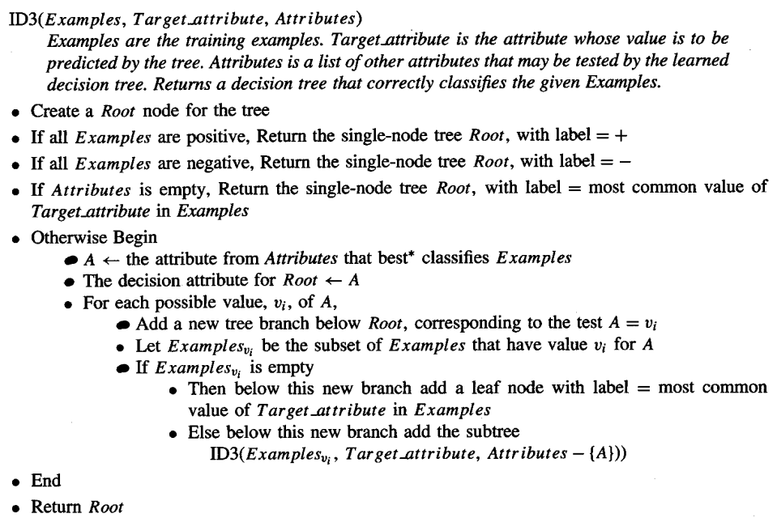
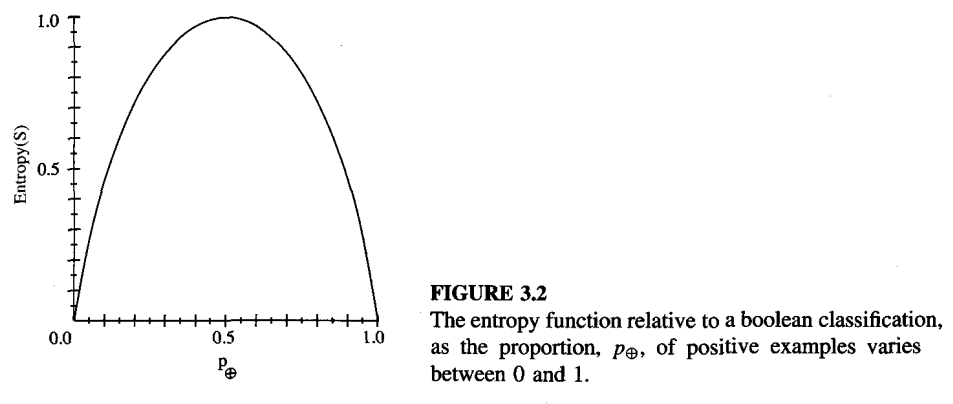

# Cap 3 - Mitchell : Decision Tree Learning

Decision trees represent a disjunction of conjunctions of constraints on the attribute values of instances.

Best suited problems for decision trees:
- Instances are represented by attribute-value pairs (a fixed set of attributes).
- The target function has discrete output values.
- Disjunctive description may be required.
- The training data may contain errors.
- The training data may contain missing attribute values.

## ID3 Algorithm (Quinlan, 1986)

- Most algorithms that have been developed for learning decision trees are variations on a core algorithm that employs a top-down, greedy search through the space of possible decision trees

- ID3 learns decision trees by constructing them topdown, beginning with the question "which attribute should be tested at the root
of the tree?' To answer this question, each instance attribute is evaluated using a statistical test to determine how well it alone classifies the training examples. The best attribute is selected and used as the test at the root node of the tree.
A descendant of the root node is then created for each possible value of this attribute, and the training examples are sorted to the appropriate descendant node

The process of selecting a new attribute and partitioning the training examples is now repeated for each nontenninal descendant node, this time using only the training examples associated with that node. Attributes that have been incorporated higher in the tree are excluded, so that any given attribute can appear at most once along any path through the tree. 

**This process continues for each new leaf node until either of two conditions is met:** 
1. every attribute has already been included along this path through the tree, or 
2. the training examples associated with this leaf node all have the same target attribute value (i.e., their entropy is zero).

### ID3 :: Hypothesis Space search
ID3 can be characterized as searching a space of hypotheses for one that fits the training examples. ID3 performs a simple-tocomplex, **hill-climbing search** through this hypothesis space guided by the information gain evaluation function.

ID3's hypothesis space of all decision trees is a complete space of finite discrete-valued functions, relative to the available attributes. Because every finite discrete-valued function can be represented by some decision tree, ID3 avoids one of the major risks of methods that search incomplete hypothesis spaces (such as methods that consider only conjunctive hypotheses): that the hypothesis space might not contain the target function.

ID3 maintains only a single current hypothesis as it searches through the space of decision trees. By determining only a single hypothesis, ID3 loses the capabilities that follow from explicitly representing all consistent hypotheses.

ID3 in its pure form performs no backtracking in its search. Therefore, it is susceptible to the usual risks of hill-climbing search without backtracking: converging to locally optimal solutions that are not globally optimal.

ID3 uses all training examples at each step in the search to make statistically based decisions regarding how to refine its current hypothesis

### Inductive Bias
It chooses the first acceptable tree it encounters in its simple-to-complex, hillclimbing search through the space of possible trees. Roughly speaking, then, the ID3 search strategy (a) selects in favor of shorter trees over  longer ones, and (b) selects trees that place the attributes with highest information gain closest to
the root. Because of the subtle interaction between the attribute selection heuristic used by ID3 and the particular training examples it encounters, it is difficult to characterize precisely the inductive bias exhibited by ID3. However, we can approximately characterize its bias as a preference for short decision trees over complex trees. 
> **A closer approximation to the inductive bias of ID3**: Shorter trees are preferred over longer trees. Trees that place high information gain attributes close to the root are preferred over those that do not. 

### Which attribute is the best classifier?

- We define a statistical property (**Information Gain**) that measures how well a given attribute separates the training examples according to their target classification.
- IDF uses it to select among the candidate attributes at each step while growing the tree.

#### Entropy (of Shannon)

- Entropy characterizes the impurity of an arbitrary collection of examples.

$$\text{Entropy}(S) = \sum_{k \in \text{TargetClasses}} P(k)\log_2(\frac{1}{P(k)}) \quad \in [0,1]$$

- Obs: $\text{Entropy}(S) = 0 \iff \exists k \in \text{TargetClasses}: (\forall x \in S: f^*(x) = k)$
- The logarithm is base 2 because entropy is a measure of the expected encoding length measured in bits.

#### Information Gain
- The information gain is the expected reduction in entropy caused by partitioning the examples according to this attribute.

$$\text{Gain}(S,A) = \text{Entropy}(S) - \sum_{v \in \text{Values}(A)} \frac{|S_v|}{|S|} \text{Entropy}(S_v)$$

Where:
- $\text{Values}(A)$ is the set of all possible values for attribute $A$.
- $S_v$ is the subset of $S$ for which attribute $A$ has value $v$ ($S_v = \{ s\in S: A(s) = v\}$).

> Obs:  The value of $\text{Gain}(S, A)$ is the number of bits saved when encoding the target value of an arbitrary member of S, by knowing the value of attribute A. 

- Information gain is precisely the measure used by ID3 to select the best attribute at each step in growing the tree.

## Restrictive Bias vs Preference Bias
- **Preference Bias (or Search Bias)**: Searches incompletely through a complete hypothesis space that contains objective function.
- **Restrictive Bias (or Language Bias)**: Searches completely through an incomplete hypothesis space.

> Typically, a preference bias is more desirable than a restriction bias, because it allows the learner to work within a complete hypothesis space that is assured to contain the unknown target function. In contrast, a restriction bias that strictly limits the set of potential hypotheses is generally less desirable, because it introduces the possibility of excluding the unknown target function altogether. 

## Occam's razor
> Prefer the simplest hypothesis that fits the data. Its an inductive bias. 

### In favour
- One argument is that because there are fewer short hypotheses than long ones (based on straightforward combinatorial arguments), it is less likely that one will find a short hypothesis that coincidentally fits the training data

### Against
- Why should we believe that the small set of hypotheses consisting of decision trees with short descriptions should be any more relevant than the multitude of other small sets of hypotheses that we might define.
-  The size of a hypothesis is determined by the particular representation used internally by the learner

### ?
- Evolution will create internal representations that make the learning algorithm's inductive bias a self-fulfilling prophecy, simply because it can alter the representation easier than it can alter the learning algorithm. 

## Stop overfitting in Decision Tree Learning
- approaches that stop growing the tree earlier, before it reaches the point where it perfectly classifies the training data,
- approaches that allow the tree to overfit the data, and then post-prune the tree. 

### Determine size of tree
- Use a separate set of examples, distinct from the training examples, to evaluate the utility of post-pruning nodes from the tree.
- Use all the available data for training, but apply a statistical test to estimate whether expanding (or pruning) a particular node is likely to produce an improvement beyond the training set.
- Use an explicit measure of the complexity for encoding the training examples and the decision tree, halting growth of the tree when this encoding size is minimized. This approach, based on a heuristic called the Minimum Description Length principle, is discussed further in Chapter 6, as well as in Quinlan and Rivest (1989) and Mehta et al. (199.5)

#### REDUCED ERROR PRUNING
One approach, called reduced-error pruning (Quinlan 1987), is to consider each of the decision nodes in the.tree to be candidates for pruning. Pruning a decision node consists of removing the subtree rooted at that node, making it a leaf node, and assigning it the most common classification of the training examples affiliated with that node. 

This has the effect that any leaf node added due to coincidental regularities in the training set is likely to be pruned because these same coincidences are unlikely to occur in the validation set.

> Coincidental regularities: Que haya ruido aleatorio en los datos y por lo tanto un riesgo alto de overfitting con árboles muy grandes

#### RULE POST-PRUNING

1. Infer the decision tree from the training set, growing the tree until the training data is fit as well as possible and allowing overfitting to occur.
2. Convert the learned tree into an equivalent set of rules by creating one rule for each path from the root node to a leaf node.
3. Prune (generalize) each rule by removing any preconditions that result in improving its estimated accuracy.
4. Sort the pruned rules by their estimated accuracy, and consider them in this sequence when classifying subsequent instances